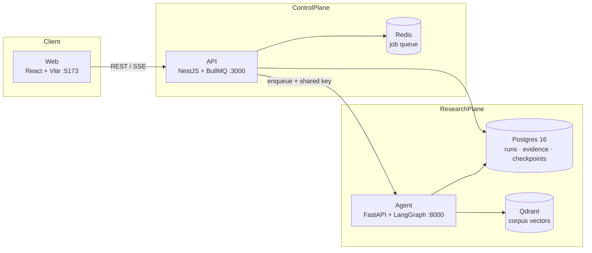
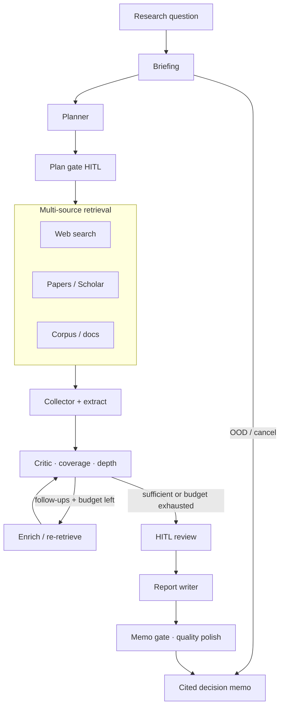

# Kiln — Evidence-Backed Decision Research for LLM Systems

[](https://github.com/quangg1/AI_Research_Agent/actions/workflows/ci.yml)

**Kiln** (`AI_Research_Agent`) turns high-stakes LLM-systems questions — serving economics, RAG architecture, agent design, evaluation — into **cited decision memos**. It is a bounded LangGraph research pipeline with tool budgets, coverage gates, contradiction analysis, and human approval checkpoints — not a general-purpose chatbot.

### Tóm tắt (VI)

**Kiln** là stack nghiên cứu sâu cho quyết định hệ thống LLM: Web (React) → API (NestJS/BullMQ) → Agent (Python/LangGraph), kèm Postgres / Redis / Qdrant. Pipeline có ngân sách tool, ResearchContract, cổng chất lượng memo (provenance số liệu, nguồn bắt buộc, lọc off-topic), và HITL trước khi publish.

- **Chạy nhanh:** one-liner bên dưới (shallow-clone vào `~/.kiln/...`, tạo `.env`, `docker compose up`).
- **Yêu cầu:** Docker Desktop; nên có ít nhất một LLM key + `TAVILY_API_KEY` cho research thật.
- **Auth local:** `AUTH_MODE=dev` (`X-Dev-Org-Id=org_default`).

---

## Architecture

### System topology



| Layer | Tech | Role |
|-------|------|------|
| **Web** | React, Vite, TypeScript | Research UI, workspace, corpus, scenarios |
| **API** | NestJS, BullMQ, SSE | Auth, org tenancy, jobs, progress stream |
| **Agent** | Python 3.12, FastAPI, LangGraph | Budgeted research graph + memo writer |
| **Postgres** | 16 | Runs, events, checkpoints, evidence |
| **Redis** | 7 | Job queue |
| **Qdrant** | 1.13 | Org-scoped corpus embeddings |

Repo layout: `apps/agent` · `apps/api` · `apps/web` · `packages/contracts` · `infra/` · `data/corpus` · `docs/`

### Research pipeline



Retrieval is **three-source** (web, papers, org corpus). The critic owns coverage slots; model “looks done” claims do not override gates. Brief, plan, and memo can interrupt for human approval (`enable_hitl=True`); showcase/eval runs can auto-pass those gates.

---

## Capabilities

### What Kiln does well

| Strength | Detail |
|----------|--------|
| **Decision-shaped output** | Memos target tradeoffs (cost, quality, ops risk), not open-ended chat |
| **Budgeted depth** | Split retrieval/enrich pools; critic respects remaining iterations and stops on real stagnation |
| **Multi-source evidence** | Web + Scholar/papers + org corpus, with domain-balanced pooling (e.g. code-skew caps) |
| **Org tenancy** | Corpus and runs are org-scoped; no cross-tenant leakage by design |
| **Eval harnesses** | Trust Bench + regression checks for citation/structure regressions in CI |

### Research agent depth

The agent is a **graph**, not a single prompt:

1. **Brief** — scope, OOD routing, constraints  
2. **Plan** — agents to run, must-answer slots  
3. **Retrieve → critic loop** — search / scholar / docs → collect → critic → enrich until coverage/depth targets or budget exhaustion  
4. **Write** — adaptive word targets from evidence quality (thin evidence → shorter memo; no forced padding)  
5. **Polish + gates** — integrity, provenance, off-topic demotion before publish  

Adaptive depth ties target length to evidence count and coverage tier so the writer is not pressured to hallucinate filler.

### Memo quality gates

Before a memo is treated as publishable, Kiln applies layered checks (domain modules under `apps/agent/app/domain/`):

| Gate | Purpose |
|------|---------|
| **ResearchContract** | Compiles query + brief into enforceable scope: `must_cover`, excluded domains, authority policy (prefer primary papers / official repos / measured evidence) |
| **Mandatory sources** | Topic-specific primaries (e.g. Hu LoRA + Dettmers QLoRA for LoRA/QLoRA VRAM questions) must appear or the run hard-gates |
| **Number provenance** | Classifies figures as span-quote / computed / multi-source estimate; demotes false “as reported by” attribution |
| **Off-topic / OOD** | Demotes HAR-sensor and other irrelevant domains that pollute ranking or memo body |
| **Coverage & structure** | Must-answer slots, citation stacking/saturation limits, composite-example labeling, empty-filler / placeholder detection |
| **Claim ↔ evidence** | Scale/topic mismatch and claim–quote style checks before publish |

These are **programmatic** gates where possible — not prompt-only hopes.

### Limitations (read before production use)

- **Full stack needs Docker** (Compose). Agent-only CLI exists for lighter experiments but is not the product UX.  
- **LLM + search keys** — without provider keys (and ideally `TAVILY_API_KEY`), runs degrade or stay demo-thin.  
- **Measured-evidence caveat** — memos cite and gate evidence they retrieve; they do not replace your own benchmarks. Multi-source estimates are labeled; treat unverified numbers with caution.  
- **Domain focus** — strongest on LLM systems (serving, RAG, agents, eval). Out-of-scope topics are routed short, not “force researched.”  
- **No public LICENSE yet** — third-party APIs (Clerk, Stripe, Tavily, LLM vendors) remain under their own terms.

---

## Quick start

**Prerequisites:** Docker Desktop (Engine + Compose v2).

### One-liner (managed shallow clone)

macOS / Linux:

```bash
curl -fsSL https://raw.githubusercontent.com/quangg1/AI_Research_Agent/main/scripts/quickstart.sh | bash
```

Windows (PowerShell):

```powershell
irm https://raw.githubusercontent.com/quangg1/AI_Research_Agent/main/scripts/quickstart.ps1 | iex
```

Install path defaults to `~/.kiln/AI_Research_Agent` (`KILN_HOME` to override). Default ref is **`main`** (`KILN_REF` to pin another branch/tag).

| Service | URL |
|---------|-----|
| **Web UI** | http://localhost:5173 |
| API health | http://localhost:3000/health |
| Agent health | http://localhost:8000/health |

First run builds images (several minutes). If [publish-ghcr](.github/workflows/publish-ghcr.yml) has published packages, quickstart prefers `ghcr.io/quangg1/kiln-*` pulls.

### Keys for real research

Edit `.env` in the install dir (`GOOGLE_API_KEY` / `OPENAI_API_KEY` / `XAI_API_KEY`, ideally `TAVILY_API_KEY`), then recreate agent + API:

```bash
cd ~/.kiln/AI_Research_Agent
docker compose -f docker-compose.yml -f docker-compose.dev.yml up -d --force-recreate agent api
```

Open http://localhost:5173 → ask a research question → confirm brief/plan gates → wait for the cited memo.

### Full local clone

```bash
git clone https://github.com/quangg1/AI_Research_Agent.git
cd AI_Research_Agent
cp .env.example .env   # set LLM + search keys
docker compose -f docker-compose.yml -f docker-compose.dev.yml up -d --build
```

Make targets: `make up` · `make down` · `make logs` · `make test` · `make eval`.

Agent-only smoke (no full stack):

```bash
cd apps/agent && pip install -e ".[dev]" && pytest -q
python -m app.cli "Does RAG always require a vector database?"
```

---

## Configuration (short)

Full list: **[`.env.example`](.env.example)**. Quickstart copies it with safe local defaults (`AUTH_MODE=dev`).

| Variable | Purpose |
|----------|---------|
| `AUTH_MODE` / `VITE_AUTH_MODE` | `dev` / `clerk` / `disabled` |
| `GOOGLE_API_KEY` / `OPENAI_API_KEY` / `XAI_API_KEY` | LLM providers |
| `TAVILY_API_KEY` | Web search (recommended) |
| `S2_API_KEY` | Semantic Scholar rate limits |
| `DATABASE_URL` / `REDIS_URL` / `QDRANT_URL` | Infra (Compose overrides hosts in containers) |
| `CLERK_*` / `STRIPE_*` | Production auth / billing |

Do not commit a filled `.env`.

**Ports:** Web `5173` · API `3000` · Agent `8000` · Postgres `5432` · Redis `6379` · Qdrant `6333` (dev overlay publishes API/agent for host health checks).

**Prebuilt images (optional):** [`docker-compose.ghcr.yml`](docker-compose.ghcr.yml) → `ghcr.io/quangg1/kiln-{agent,api,web}`.

---

## Further docs

- [docs/agent-research-system.md](docs/agent-research-system.md) — pipeline topology, budgets, writer controls  
- [docs/ops.md](docs/ops.md) — operations  
- [docs/deploy-render.md](docs/deploy-render.md) · [docs/deploy-oracle.md](docs/deploy-oracle.md) — deploy  
- [docs/regression-testing.md](docs/regression-testing.md) — quality regression harness  

---

## Design principles

1. **Budgeted pipeline** — split retrieval/enrich pools; critic respects remaining iterations.  
2. **Rules outside the graph** — business logic in `domain/`; nodes orchestrate.  
3. **Critic is authoritative** — coverage slots trump model “sufficient” claims.  
4. **Three-source retrieval** — web, papers, corpus.  
5. **Human gates** — brief, plan, and memo before publish.  
6. **Org-scoped knowledge** — no cross-tenant corpus leakage.

---

## License

No `LICENSE` file is published yet. Third-party APIs require their own account keys and terms.