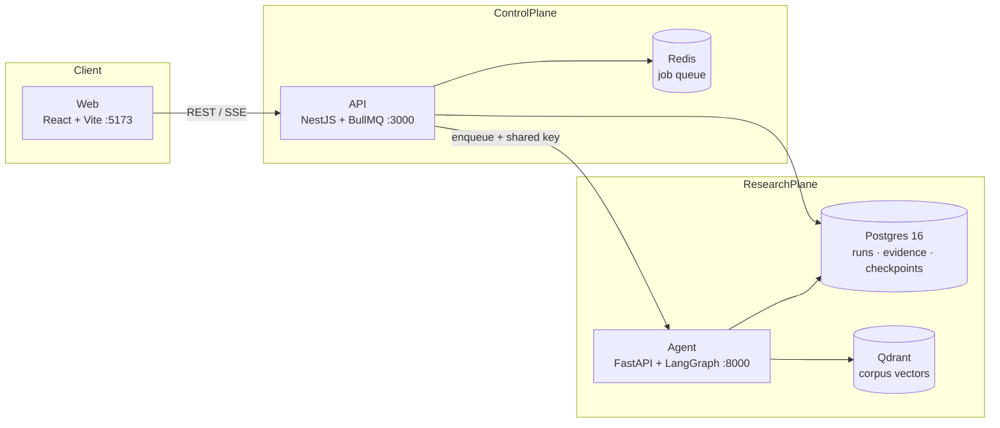
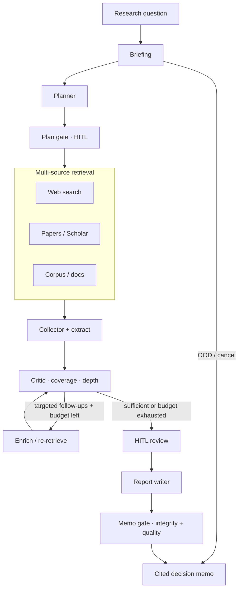

# Kiln — Evidence-Backed Decision Research for LLM Systems

[](https://github.com/quangg1/AI_Research_Agent/actions/workflows/ci.yml)
&nbsp;
&nbsp;
&nbsp;
&nbsp;

**Kiln** turns a hard LLM-systems question — "vLLM or TensorRT-LLM for this workload?", "does RAG need a vector DB here?" — into a **cited decision memo**: claims, quotes, contradictions, and an explicit confidence score, or an honest "insufficient evidence" instead of a confident guess.

It is not a chatbot wrapper. It's a **budgeted LangGraph state machine**: a critic that gates on measured coverage (not the model's own "looks done"), a citation-integrity pipeline that checks every number against the source that supposedly measured it, and human-approval checkpoints before anything publishes. The interesting engineering is almost entirely in making a non-deterministic LLM pipeline behave like a system with guarantees — bounded cost, no infinite loops, no fabricated citations, no confident nonsense.

---

## See it work

A real run of this pipeline (`docker compose up`, one API call, no manual editing) on *"Compare vLLM, TensorRT-LLM, and SGLang for production inference serving: throughput, latency, KV-cache efficiency, and feature completeness"*:

> **Key findings**
> 1. TensorRT-LLM achieves up to 5x acceleration in Time-to-First-Token (TTFT) through system prompt early KV-cache reuse, with speedups reaching 14x to 28x under high prefix-overlap concurrency regimes **[2 primary]**.
> 2. Granular control over KV-cache memory allocation in TensorRT-LLM allows block sizes to be tuned from 64 tokens down to 2 tokens, reducing memory fragmentation and increasing dynamic batch capacity **[2 primary]**.
>
> | Metric | Value | Condition | Source |
> |---|---|---|---|
> | TTFT acceleration (early reuse) | 5x | Shared system prompt across concurrent requests | [2 primary] |
> | NVLink bandwidth (H100/H200) | 900 GB/s | 8× GPU interconnect | [7 primary] |
>
> — Confidence 93/100 (deep) · 11 sources · every `[n]` resolves to a real, fetched reference

Every `[n]` is a real citation the pipeline retrieved and re-checked against — not a plausible-looking hallucination. That guarantee is the hard part; see below.

---

## Why this is hard (the actual engineering)

Anyone can prompt an LLM to write a report with `[1]`-style citations. Getting the citations to be *true*, the loop to *terminate*, and the memo to *admit what it doesn't know* is a different problem. A few examples of what's actually enforced in code, not just asked for in a prompt:

- **Citations are verified, not trusted.** `domain/quantitative_verify.py` checks every number in the memo against the actual text of the source it's attributed to — a figure with no matching span in its cited source gets flagged and surfaced to the reader (`"Unverified attribution: ... cited to [n], but the cited source text does not contain the figure"`), instead of silently shipping.
- **A hard-coded quality regex almost broke every unrelated query.** A scope-detection check meant for "LoRA/QLoRA VRAM comparison" questions matched the bare phrase *"memory footprint"* — so a query about vector-index memory layout got silently forced to cite two specific fine-tuning papers it had no reason to reference, contaminating a third of the memo with off-topic content before the gate would even let it publish. Root-caused and fixed by scoping the trigger to the actual topic, not a keyword; regression test pins the fix.
- **The research loop has a memory, so it can't flail forever.** Early versions kept re-issuing the *exact same* follow-up search after it had already failed to move coverage — burning budget and wall-clock time chasing a dead end. The critic now tracks which specific gaps were tried and produced zero improvement, and excludes them from the next round instead of repeating them (`graph/nodes/critic.py`, `_unproductive_gap_ids`).
- **Two independent "is this gate diagnosing itself" bugs.** A stagnation detector double-counted its own quality history (`after_critic` appended the same snapshot `critic_node` had already recorded, making 2 real iterations look like 3 stagnant ones); separately, a citation-integrity re-scan ran on the memo's own `## Limitations` section, re-discovering its previously-published warnings as new "unverified" claims and compounding them across report-regeneration retries. Both fixed by giving the audit passes an idempotent view of their own prior output.
- **Adaptive, not padded, length.** Memo length scales with retrieved evidence quality (`report/adaptive_depth.py`: `evidence_items × 80 words × coverage_multiplier`, bounded 800–7000 words) instead of a fixed target — thin evidence gets a short, honest memo instead of an LLM padding filler to hit a word count.
- **Budget is split and reserved, not just capped.** Retrieval and full-text-enrichment are separate pools (`RETRIEVAL_POOL` / `ENRICH_POOL`) with the first iteration's spend explicitly reserved against so later follow-up rounds aren't starved to zero (`graph/nodes/planner.py::_reserve_calls`) — a naive single budget counter let iteration 1 spend everything before the critic loop ever got a real turn.

None of this is prompt engineering. It's state tracked across a LangGraph checkpoint, deterministic Python gates in `domain/`, and ~30 regression tests that pin down exactly the failure mode each fix targets — because the failure mode was first *reproduced* against real run data before being called fixed.

---

## Architecture

### System topology



| Layer | Tech | Role |
|-------|------|------|
| **Web** | React, Vite, TypeScript | Research UI, workspace, corpus, scenarios |
| **API** | NestJS, BullMQ, SSE | Auth, org tenancy, job queue, progress stream, run lifecycle |
| **Agent** | Python 3.12, FastAPI, LangGraph | Budgeted research graph + memo writer + quality gates |
| **Postgres** | 16 | Runs, events, LangGraph checkpoints, evidence, knowledge cache |
| **Redis** | 7 | Job queue (BullMQ) |
| **Qdrant** | 1.13 | Org-scoped corpus embeddings |

Repo layout: `apps/agent` (research engine) · `apps/api` (control plane) · `apps/web` (UI) · `packages/contracts` (shared types) · `infra/` (SQL migrations) · `docs/`

### Research pipeline



Retrieval is **three-source** (web, papers, org corpus). The critic — not the model's self-report — owns coverage: `must_answer` slots, contradiction detection, and named-entity coverage gates all live in plain Python (`domain/coverage.py`, `domain/coverage_gate.py`) so they're unit-testable without a live LLM call. Brief, plan, and memo are LangGraph `interrupt()` checkpoints for human approval; eval/showcase runs auto-confirm them.

---

## Testing & quality rigor

| | |
|---|---|
| **549 tests** | 508 pytest (agent domain logic, graph routing, integrity gates) · 23 Jest (API repository/service) · 18 Vitest (web) |
| **CI on every push** | pytest + a routing eval, NestJS build/test/typecheck, Vite build/test/typecheck — see [`ci.yml`](.github/workflows/ci.yml) |
| **Golden-set regression harness** | `apps/agent/app/eval/regression_check.py` runs real queries through the live graph and scores structure, coverage, and citation quality against a fixed test set — not mocked, so a change that quietly degrades memo quality fails the check |
| **Root-cause discipline** | Nearly every fix above shipped with a test that reproduces the *original* failure against the actual data that exposed it, not just the patched behavior — see `tests/test_report_integrity.py`, `tests/test_coverage.py`, `tests/test_research_contract.py` |

```bash
cd apps/agent && pytest -q          # 508 tests, ~15s, no live LLM calls needed
cd apps/api && npm test             # 23 tests
cd apps/web && npm test             # 18 tests
```

---

## Memo quality gates

Before a memo is treated as publishable, layered checks run in `apps/agent/app/domain/`:

| Gate | Purpose |
|------|---------|
| **ResearchContract** | Compiles query + brief into enforceable scope: `must_cover`, excluded domains, authority policy (prefer primary papers / official repos over blogs) |
| **Mandatory sources** | Topic-scoped: e.g. a LoRA/QLoRA VRAM question must cite the actual Hu/Dettmers papers or the run hard-gates — scoped to the real topic, not a keyword match |
| **Number provenance** | Every load-bearing figure is checked against its cited source's actual text; unverified numbers are surfaced, not silently trusted |
| **Source concentration** | Flags when one low-tier, uncorroborated source is doing the work of the memo's central claims |
| **Coverage & structure** | Must-answer slots, citation-stacking limits, composite-example labeling, dangling-citation cleanup (a `[6]` with no matching reference gets stripped, not left for the reader to chase) |
| **Named-subject gate** | A framework the question explicitly named but the evidence never covered is disclosed in Limitations, not silently dropped |

These are **programmatic** gates — deterministic Python that runs whether or not the model felt like following the prompt — not prompt-only hopes.

---

## Limitations (read before production use)

- **Full stack needs Docker** (Compose). An agent-only CLI exists for lighter experiments but isn't the product UX.
- **LLM + search keys required** — without provider keys (and ideally `TAVILY_API_KEY`), runs degrade or stay demo-thin.
- **Measured-evidence caveat** — memos cite and gate the evidence they retrieve; they don't replace your own benchmarks. Multi-source estimates are labeled; treat unverified numbers with the caution the memo itself flags.
- **Domain focus** — strongest on LLM systems (serving, RAG, agents, eval). Out-of-scope topics route short, not "force researched."
- **No public LICENSE yet** — third-party APIs (Clerk, Stripe, Tavily, LLM vendors) remain under their own terms.

---

## Quick start

**Prerequisites:** Docker Desktop (Engine + Compose v2).

### One-liner (managed shallow clone)

macOS / Linux:

```bash
curl -fsSL https://raw.githubusercontent.com/quangg1/AI_Research_Agent/main/scripts/quickstart.sh | bash
```

Windows (PowerShell):

```powershell
irm https://raw.githubusercontent.com/quangg1/AI_Research_Agent/main/scripts/quickstart.ps1 | iex
```

Install path defaults to `~/.kiln/AI_Research_Agent` (`KILN_HOME` to override). Default ref is **`main`** (`KILN_REF` to pin another branch/tag).

| Service | URL |
|---------|-----|
| **Web UI** | http://localhost:5173 |
| API health | http://localhost:3000/health |
| Agent health | http://localhost:8000/health |

First run builds images (several minutes). If [publish-ghcr](.github/workflows/publish-ghcr.yml) has published packages, quickstart prefers `ghcr.io/quangg1/kiln-*` pulls.

### Keys for real research

Edit `.env` in the install dir (`GOOGLE_API_KEY` / `OPENAI_API_KEY` / `XAI_API_KEY`, ideally `TAVILY_API_KEY`), then recreate agent + API:

```bash
cd ~/.kiln/AI_Research_Agent
docker compose -f docker-compose.yml -f docker-compose.dev.yml up -d --force-recreate agent api
```

Open http://localhost:5173 → ask a research question → confirm brief/plan gates → wait for the cited memo.

### Full local clone

```bash
git clone https://github.com/quangg1/AI_Research_Agent.git
cd AI_Research_Agent
cp .env.example .env   # set LLM + search keys
docker compose -f docker-compose.yml -f docker-compose.dev.yml up -d --build
```

Make targets: `make up` · `make down` · `make logs` · `make test` · `make eval`.

Agent-only smoke (no full stack):

```bash
cd apps/agent && pip install -e ".[dev]" && pytest -q
python -m app.cli "Does RAG always require a vector database?"
```

---

## Configuration (short)

Full list: **[`.env.example`](.env.example)**. Quickstart copies it with safe local defaults (`AUTH_MODE=dev`).

| Variable | Purpose |
|----------|---------|
| `AUTH_MODE` / `VITE_AUTH_MODE` | `dev` / `clerk` / `disabled` |
| `GOOGLE_API_KEY` / `OPENAI_API_KEY` / `XAI_API_KEY` | LLM providers |
| `TAVILY_API_KEY` | Web search (recommended) |
| `S2_API_KEY` | Semantic Scholar rate limits |
| `DATABASE_URL` / `REDIS_URL` / `QDRANT_URL` | Infra (Compose overrides hosts in containers) |
| `CLERK_*` / `STRIPE_*` | Production auth / billing |

Do not commit a filled `.env`.

**Ports:** Web `5173` · API `3000` · Agent `8000` · Postgres `5432` · Redis `6379` · Qdrant `6333` (dev overlay publishes API/agent for host health checks).

**Prebuilt images (optional):** [`docker-compose.ghcr.yml`](docker-compose.ghcr.yml) → `ghcr.io/quangg1/kiln-{agent,api,web}`.

---

## Further docs

- [docs/agent-research-system.md](docs/agent-research-system.md) — full pipeline topology, budget pools, writer controls
- [docs/ops.md](docs/ops.md) — operations
- [docs/deploy-render.md](docs/deploy-render.md) · [docs/deploy-oracle.md](docs/deploy-oracle.md) — deploy
- [docs/regression-testing.md](docs/regression-testing.md) — quality regression harness

---

## Design principles

1. **Budgeted pipeline** — split retrieval/enrich pools; the critic respects remaining iterations and stops on real stagnation, not a token count running out mid-thought.
2. **Rules live outside the graph** — business logic in `domain/`; nodes only orchestrate. Every gate is a plain function you can unit-test without FastAPI or a live LLM.
3. **The critic is authoritative** — coverage slots and citation checks override the model's own "looks sufficient" claim.
4. **Three-source retrieval** — web, papers, org corpus, one collector.
5. **Human gates** — brief, plan, and memo checkpoints before anything publishes.
6. **Org-scoped knowledge** — corpus and cached answers are tenant-isolated by construction, not by convention.

---

## About

Built and actively debugged solo — the "Why this is hard" section above documents real bugs found by generating memos, reading them critically, and tracing failures back to root cause in the pipeline, not a feature checklist written in advance. GitHub: [@quangg1](https://github.com/quangg1).

## License

No `LICENSE` file is published yet. Third-party APIs require their own account keys and terms.
